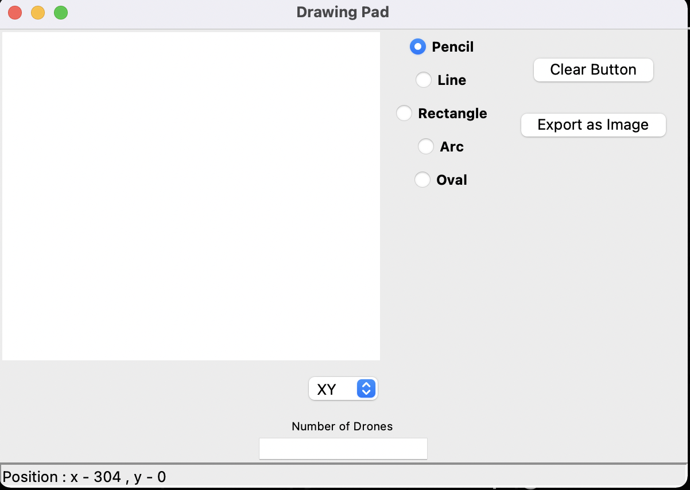

# drone-ps

## Installation
Require python>=3.6
```
pip install -r requirements.txt
```
## GUI
<p align="center">

 </p>
**Number of drones** - Shall be provided as input


**Plane** - XY, YZ and ZX are available as mentione in PS

**Export as image** - Exports the image and generates coordinate.txt file containing information about the coordinates of the drone.<br>Screen size is also mentioned as coordinates of drone can vary from screen size which can be normalized.
                  
**Tools** - Various drawing tools have been provided to draw shapes as well as insert button is provided to upload other image.

## Running as Script
To run the program directly as a python script run the following command:(Executables files can also be developed as mentioned below)
```
python app.py
```

## Executables
To run as standalone application
## .app in macOS
```
pip install pyinstaller==5.1
```

You need to add a logo for your application. Replace 0.jpg with the path of your logo.

```
pyinstaller --add-data '0.jpg:.' app.py
pyinstaller app.spec
```
```
mkdir appfolder
```
* Copy all the contents of dist/app/ and paste it to appfolder
* Rename appfolder to **app.app**

## .exe in Windows
```
pip install pyinstaller
```
Use pyinstaller to convert into .exe :
```
pyinstaller --onefile --windows --icon=logo.ico app.py
